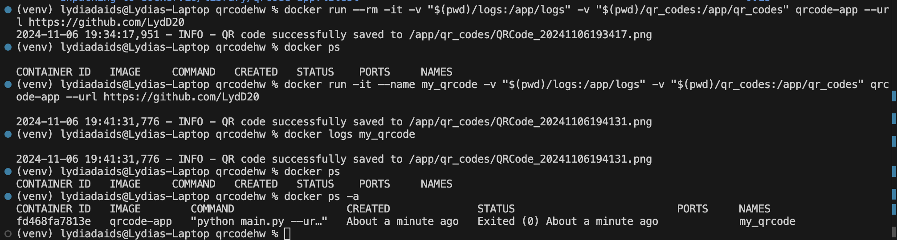

# Homwork 7: Creating a QR Code with Docker
## Submission Requirements:
*Note* I was practicing QR Code generation so I have two extra QR codes not in logging.
1. QR Code Image which links to my GitHub homepageAdd the QR code.

2. Image of successful logging for creating the QR Code. 
